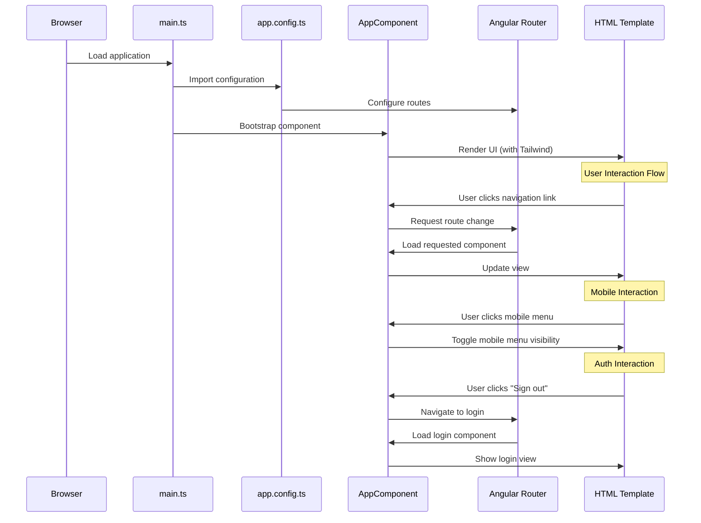

# Angular Starter Project with Tailwind CSS

This project represents a modern Angular application (version 19.2.3) that integrates Tailwind CSS for styling and includes routing capabilities with a simple authentication foundation.

## Project Overview

The Angular Starter project provides a solid foundation for building single-page applications (SPAs) with Angular. It's configured with:

- Angular 19.2.x (latest major version)
- Tailwind CSS 4.0.14 for utility-first styling
- Angular Router for navigation between views
- A pre-built responsive navigation header with mobile support

## Project Structure and Key Files

### Core Application Files

- **App Component Files**
  - `app.component.ts`: The root component that defines the application shell
  - `app.component.html`: Contains a responsive navigation interface with desktop and mobile layouts
  - `app.component.css`: Empty stylesheet (styles are handled by Tailwind)

- **Configuration Files**
  - `app.config.ts`: Application configuration with routing and zone.js change detection
  - `app.routes.ts`: Currently empty route definitions, ready for extension
  - `package.json`: Dependencies including Angular 19.2, RxJS, and Tailwind CSS

- **Entry Points**
  - `main.ts`: Application bootstrap process
  - `index.html`: HTML template with proper Tailwind classes for full-height layout
  - `styles.css`: Imports Tailwind CSS

### Testing Infrastructure

- `app.component.spec.ts`: Test specifications for the app component

## UI Components and Features

The template includes a professional UI with:

### Navigation System
- Responsive top navigation bar with logo
- Desktop and mobile navigation modes
- Animated menu transitions

### User Interface Elements
- User profile dropdown menu
- Notification button with accessible design
- Dashboard layout with header and content area

### Authentication Foundation
While not fully implemented, the UI structure includes:
- User profile display (currently showing "Tom Cook")
- Sign out option in dropdown menu
- Protected route structure (via Angular Router)

## Development Workflow

The project follows standard Angular development practices:

1. **Development Server**
   - Start with `ng serve`
   - Access at `http://localhost:4200/`
   - Automatic reloading on file changes

2. **Code Generation**
   - Create components: `ng generate component component-name`
   - Generate other artifacts with CLI help: `ng generate --help`

3. **Building for Production**
   - Run `ng build`
   - Optimized output in `dist/` directory

4. **Testing**
   - Unit tests with Karma: `ng test`
   - E2E test infrastructure available via `ng e2e`

## Styling with Tailwind CSS

The project leverages Tailwind CSS for styling with:
- Utility-first approach (no custom CSS needed)
- Responsive design utilities (`sm:`, `lg:`, etc. prefixes)
- Interactive states (hover, focus)
- Accessibility features (sr-only content)

## Sequence Diagram

## Architecture Highlights

### Standalone Components
The application uses Angular's standalone component architecture, reducing the need for NgModules.

### Zone-based Change Detection
The app is configured with zone-based change detection with event coalescing for performance optimization.

### Mobile-First Approach
The UI is designed with a mobile-first approach, with specific optimizations for different screen sizes.

## Next Steps for Development

To extend this starter project:

1. **Add Route Components**
   - Create components for each page
   - Define routes in `app.routes.ts`

2. **Implement Authentication**
   - Add login/registration components
   - Implement auth guards for protected routes
   - Connect to authentication service

3. **Create Data Services**
   - Add services for API communication
   - Implement state management

4. **Enhance UI Components**
   - Create reusable UI components
   - Extend Tailwind with custom theme values if needed

This Angular Starter provides an excellent foundation for building modern, responsive web applications with a clean architecture and professional UI.
